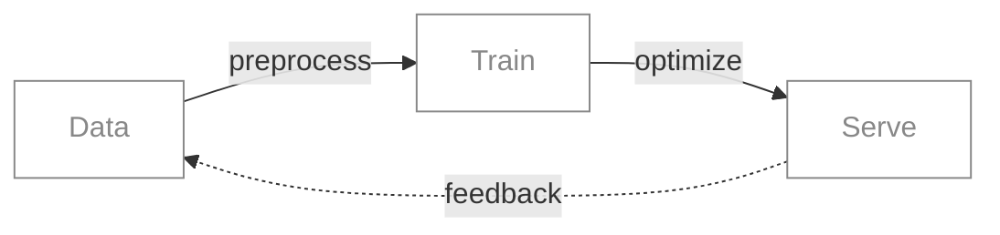

  

<!-- ═══ Hero: Custom animated SVG with CSS keyframes ═══ -->

<picture>
  <source media="(prefers-color-scheme: dark)" srcset="assets/hero-dark.svg" />
  <source media="(prefers-color-scheme: light)" srcset="assets/hero-light.svg" />
  
</picture>

 

   

<!-- ═══ About:  for restrained typography ═══ -->

ML / MLOps Engineer at MTSCO 
Research in diffusion models 
M.S. Artificial Intelligence, Hanyang University

   

<!-- ═══ Divider: Animated SVG line expanding from center ═══ -->

<picture>
  <source media="(prefers-color-scheme: dark)" srcset="assets/divider-dark.svg" />
  <source media="(prefers-color-scheme: light)" srcset="assets/divider-light.svg" />
  
</picture>

  

<!-- ═══ Tech Stack: skillicons with auto dark/light ═══ -->

<picture>
  <source media="(prefers-color-scheme: dark)" srcset="https://skillicons.dev/icons?i=python,go,pytorch,docker,kubernetes&theme=dark" />
  <source media="(prefers-color-scheme: light)" srcset="https://skillicons.dev/icons?i=python,go,pytorch,docker,kubernetes&theme=light" />
  
</picture>

   

<picture>
  <source media="(prefers-color-scheme: dark)" srcset="assets/divider-dark.svg" />
  <source media="(prefers-color-scheme: light)" srcset="assets/divider-light.svg" />
  
</picture>

  

<!-- ═══ Research: 
 accordion + LaTeX math rendering ═══ -->

<kbd>&nbsp;Research&nbsp;</kbd>

 

$$q(x_t \mid x_0) = \mathcal{N}\!\left(x_t;\; \sqrt{\bar{\alpha}_t}\, x_0,\; (1-\bar{\alpha}_t)\,\mathbf{I}\right)$$

 

Exploring denoising diffusion probabilistic models for generative tasks and inverse problems.

 

  

<picture>
  <source media="(prefers-color-scheme: dark)" srcset="assets/divider-dark.svg" />
  <source media="(prefers-color-scheme: light)" srcset="assets/divider-light.svg" />
  
</picture>

  

<!-- ═══ Mermaid: Native diagram rendering in GitHub markdown ═══ -->

 

<picture>
  <source media="(prefers-color-scheme: dark)" srcset="assets/divider-dark.svg" />
  <source media="(prefers-color-scheme: light)" srcset="assets/divider-light.svg" />
  
</picture>

  

<!-- ═══ 3D Contribution: isometric calendar via GitHub Actions ═══ -->

<picture>
  <source media="(prefers-color-scheme: dark)" srcset="https://raw.githubusercontent.com/anomredux/anomredux/output/profile-night-view.svg" />
  <source media="(prefers-color-scheme: light)" srcset="https://raw.githubusercontent.com/anomredux/anomredux/output/profile-green-animate.svg" />
  
</picture>

   

<picture>
  <source media="(prefers-color-scheme: dark)" srcset="assets/divider-dark.svg" />
  <source media="(prefers-color-scheme: light)" srcset="assets/divider-light.svg" />
  
</picture>

  

<!-- ═══ Links: <kbd> tags for keyboard-key styled buttons ═══ -->

<kbd><a href="https://mghong.dev/">mghong.dev</a></kbd>
&nbsp;&nbsp;
<kbd><a href="https://mghong.dev/blog">blog</a></kbd>
&nbsp;&nbsp;
<kbd><a href="mailto:me@mghong.dev">me@mghong.dev</a></kbd>

  

 

<!-- ═══ Markdown tricks used in this README:
  1. Custom SVG with CSS @keyframes animation (hero, dividers)
  2. <picture> + <source> with prefers-color-scheme (auto dark/light)
  3. 

 interactive accordion (research section)
  4. LaTeX math rendering with $$ (diffusion equation)
  5. Mermaid diagram with custom styling (ML pipeline)
  6. <kbd> tags for keyboard-key styled elements (links)
  7.  for typographic hierarchy (about section)
  8. skillicons.dev with theme parameter (tech stack)
  9. GitHub Actions → raw.githubusercontent.com pipeline (3D contrib)
═══ -->

